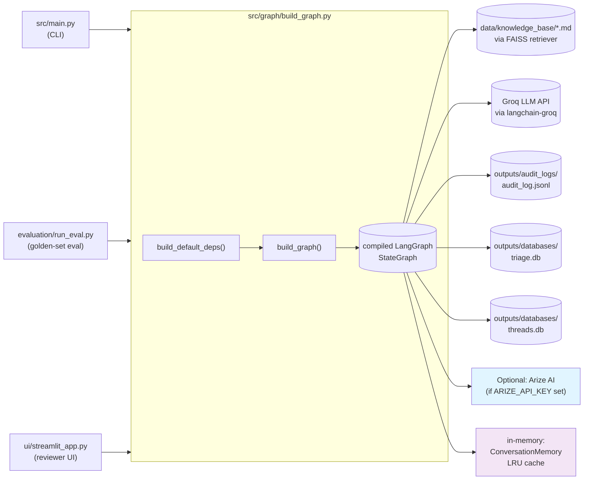
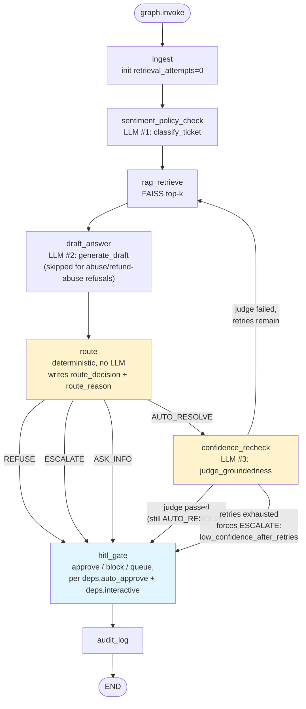
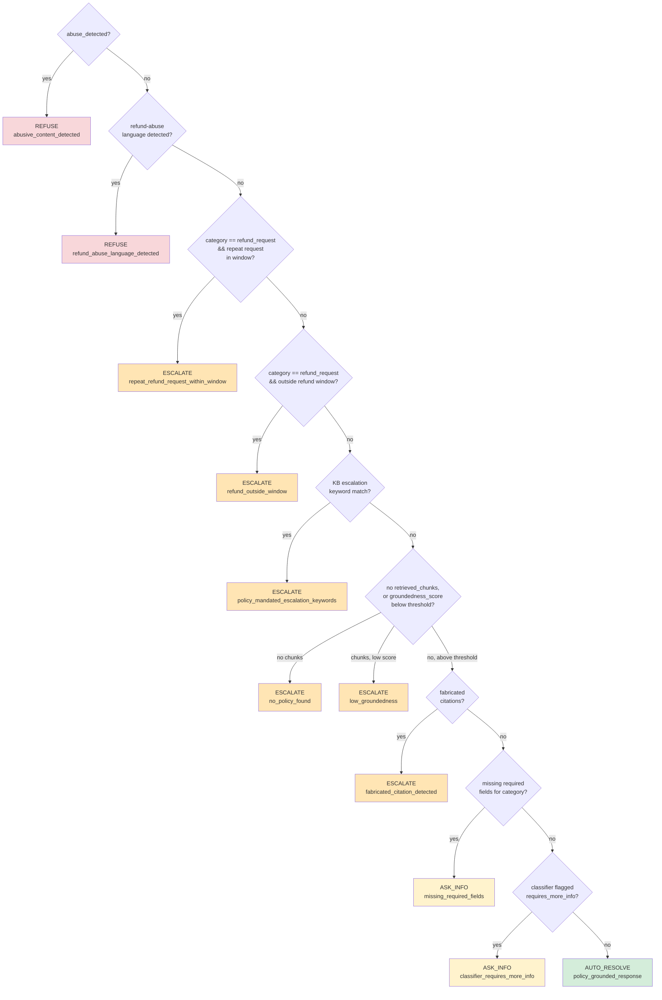

# Support Triage Agent — Architecture & Code Flow

This document explains how the codebase actually executes: where the process starts, what calls what, and what every method does. For *why* things are designed this way, see `support_triage_agent_implementation_plan.md` (original design) and `PROGRESS.md` (build history and decisions). For a summary of recent refactoring and new modules, see `REFACTORING.md`. This document is the "how it runs" reference.

---

## 1. System at a glance

The app has one shared core — a LangGraph state machine that turns a `Ticket` into a reviewable draft decision — and three different front doors that drive it:

Every entry point does the same three things, then diverges only in how it feeds tickets in and what it does with the result:

1. `settings = get_settings()` — load config + `.env`, fail fast if `GROQ_API_KEY` is missing.
2. `deps = build_default_deps(...)` — construct the LLM client, the retriever, the audit logger, and the review store.
3. `graph = build_graph(deps)` — wire the LangGraph nodes and edges into a runnable state machine.

Then each entry point calls `graph.invoke({"ticket": some_ticket})` one or more times.

---

## 2. Entry points

| Entry point | Command | What it does with results |
|---|---|---|
| CLI | `python -m src.main --ticket TCK-1001` or `--all` | Prints route + reason, writes `outputs/results/<ticket_id>.json` |
| Eval harness | `python evaluation/run_eval.py` | Runs every ticket, scores against `evaluation/golden_dataset.json`, writes `outputs/evaluation_reports/eval_report.json` |
| Reviewer UI | `streamlit run ui/streamlit_app.py` | Runs one ticket at a time on demand, shows the reviewer queue, persists Approve/Reject/Edit/Regenerate/Escalate actions to `outputs/databases/triage.db` |

All three ultimately call the same `graph.invoke(...)` — nothing ticket-processing-related is duplicated between them.

---

## 3. Code flow — CLI (`python -m src.main --ticket TCK-1001`)

This is the simplest path to trace end to end.

1. **`src/main.py:main()`** parses `argparse` flags (`--ticket`/`--all`, `--auto-approve`, `--queue`).
2. Calls **`get_settings()`** (`src/config/settings.py`) — see §5.1 for what this does internally. Cached via `@lru_cache`, so this is a no-op on any later call in the same process.
3. Calls **`build_default_deps(auto_approve=..., interactive=not args.queue, settings=settings)`** (`src/graph/build_graph.py`) — see §5.4. This is where the LLM client, retriever, audit logger, conversation memory, thread store, and DB connection actually get constructed. Arize integration is auto-enabled if `ARIZE_API_KEY` environment variable is set.
4. Calls **`build_graph(deps)`** (`src/graph/build_graph.py`) — see §5.4. Builds and compiles the LangGraph `StateGraph` (§4 below covers what the graph does).
5. Calls **`load_tickets(settings)`** (`src/main.py`) — reads `data/synthetic_tickets.json`, parses each entry into a `Ticket` (`src/models/ticket.py`) via Pydantic validation.
6. If `--ticket TCK-1001` was passed, filters the list down to that one ticket (raises `SystemExit` if not found).
7. For each ticket, calls **`run_ticket(graph, ticket, results_dir)`** (`src/main.py`):
   - Calls `graph.invoke({"ticket": ticket})` — this runs the *entire* LangGraph pipeline synchronously (§4) and returns the final `GraphState` dict.
   - Calls `_serialize_state(state)` to convert the `Ticket` object inside the state back to a plain dict (Pydantic's `.model_dump()`), since the raw state isn't JSON-serializable as-is.
   - Writes the serialized state to `outputs/results/<ticket_id>.json`.
   - Returns the serialized dict.
8. Prints `f"{ticket_id}: {route_decision} ({route_reason})"` for each ticket.

With `--queue` instead of the default, step 3 passes `interactive=False`, which changes how the `hitl_gate` node behaves inside the graph (§4.6) — instead of blocking on `input()`, it just leaves the ticket `PENDING_REVIEW` in the SQLite queue for the Streamlit UI to pick up later.

---

## 4. The LangGraph pipeline — what `graph.invoke()` actually runs

This is the core of the app. `build_graph(deps)` wires seven node functions and the conditional edges between them into a single compiled `StateGraph`. Every node is a plain Python closure that takes the current `GraphState` dict and returns a partial dict of updates (LangGraph merges these into the running state).

Note the node is named `"route"`, not `"route_decision"` — LangGraph forbids a node id identical to a `GraphState` key, and `route_decision` is the state field that node writes. `confidence_recheck` is the only node that can override a decision `route` already made (§4.6). The four `route_decision` values collapse three arrows into `hitl_gate` above for readability — see §4.5's decision tree below for exactly which condition produces which of the ten `route_reason` codes.

### 4.1 `ingest` — `src/graph/nodes/ingest.py::make_ingest_node(deps)`

Returns a closure `ingest(state)`:
- Reads `state["ticket"]` (already populated by whoever called `graph.invoke`).
- Writes one audit log entry (`{"ticket_id", "category_hint"}`).
- Returns `{"retrieval_attempts": 0}` — initializes the retry counter used later by the confidence-recheck loop.

### 4.2 `sentiment_policy_check` — `src/graph/nodes/sentiment_policy_check.py::make_sentiment_policy_check_node(deps)`

Returns a closure `sentiment_policy_check(state)`:
- Calls **`detect_abuse(ticket.message)`** (`src/rules/abuse_detection.py`) — a deterministic keyword scan (see §6.4), *always* runs regardless of what the classifier says.
- Calls **`classify_ticket(ticket, deps.llm, deps.settings)`** (`src/agents/sentiment_agent.py`) — the first LLM call in the pipeline (see §6.2).
- Logs and returns `{abuse_detected, sentiment, detected_category, requires_more_info, missing_fields, conversation_turns}` into state.

### 4.3 `rag_retrieve` — `src/graph/nodes/rag_retrieve.py::make_rag_retrieve_node(deps)`

Returns a closure `rag_retrieve(state)`:
- Builds `base_query = f"{ticket.subject} {ticket.message}"`.
- Checks `state.get("query_reformulation_hint")` — set only by `confidence_recheck` on a retry (§4.5). If present, appends it to the query and widens `k` from 3 to 5.
- Calls **`deps.retriever.retrieve(query, k)`** (`src/rag/retriever.py`, see §6.5) — FAISS similarity search over the knowledge base.
- Logs and returns `{"retrieved_chunks": chunks, "retrieval_attempts": <incremented>}`.

This node runs twice per ticket only when the confidence-recheck loop retries (§4.5); otherwise once.

### 4.4 `draft_answer` — `src/graph/nodes/draft_answer.py::make_draft_answer_node(deps)`

Returns a closure `draft_answer(state)`:
- Calls **`compute_groundedness(retrieved_chunks)`** (`src/agents/response_agent.py`, §6.3) — the raw FAISS-similarity groundedness score, computed unconditionally (used later by `route` regardless of which branch below fires).
- Branches:
  - If `state["abuse_detected"]` → uses the fixed string `settings.refusal_templates["abusive"]`. **No LLM call.**
  - Else if **`detect_refund_abuse_language(ticket.message, settings)`** (`src/rules/refund_rules.py`, §6.4) → uses `settings.refusal_templates["refund_abuse"]`. **No LLM call.**
  - Else → calls **`generate_draft(ticket, retrieved_chunks, deps.llm)`** (imported as `draft_answer` from `src/agents/response_agent.py`, §6.2) — the second LLM call. Then calls **`find_fabricated_citations(draft_reply, retrieved_chunks)`** (`src/agents/response_agent.py`, §6.3) to check every `[source: x.md]` citation in the draft actually corresponds to a retrieved chunk.
- Logs and returns `{"draft_reply", "groundedness_score", "fabricated_citations"}`.

### 4.5 `route` — `src/graph/nodes/route_decision.py::make_route_decision_node(deps)`

Returns a closure `route_decision(state)` — pure deterministic Python, **no LLM call**. This is the safety-critical decision function; it evaluates conditions in a fixed precedence order and stops at the first match:

1. `abuse_detected` → `REFUSE` (`abusive_content_detected`)
2. `detect_refund_abuse_language(message, settings)` → `REFUSE` (`refund_abuse_language_detected`) — checked regardless of category, not just `refund_request`
3. `category == "refund_request"` and `check_repeat_request(ticket, settings)` → `ESCALATE` (`repeat_refund_request_within_window`)
4. `category == "refund_request"` and `not check_refund_window(ticket, settings)` → `ESCALATE` (`refund_outside_window`)
5. `detect_escalation_keywords(category, message, settings)` → `ESCALATE` (`policy_mandated_escalation_keywords`) — turns KB "escalate on X" text into a checkable rule
6. No `retrieved_chunks` → `ESCALATE` (`no_policy_found`); or `groundedness_score < settings.groundedness_threshold` → `ESCALATE` (`low_groundedness`)
7. `fabricated_citations` non-empty → `ESCALATE` (`fabricated_citation_detected`)
8. `missing_required_fields(category, ticket, settings)` non-empty → `ASK_INFO` (`missing_required_fields`)
9. `requires_more_info` (from the classifier) → `ASK_INFO` (`classifier_requires_more_info`)
10. Otherwise → `AUTO_RESOLVE` (`policy_grounded_response`)

`category` here is `state.get("detected_category") or ticket.category` — the LLM classifier's output takes priority over whatever category the raw ticket data was tagged with. Logs and returns `{"route_decision", "route_reason"}`.

Rules are evaluated top-to-bottom and stop at the first match — e.g. an abusive message about a repeat refund request is `REFUSE`, never `ESCALATE`, because rule 1 short-circuits before rule 3 is even checked. TCK-1017 (the GDPR ticket walked through in `notebooks/tck_1017_walkthrough.ipynb`) hits `ESC5` (`low_groundedness`): retrieval does return chunks, but the top similarity score is below `settings.groundedness_threshold`.

**Where this routes next** (`build_graph.py`'s `_route_branch`, a `graph.add_conditional_edges` lambda): `AUTO_RESOLVE` → `confidence_recheck`; the other three routes go straight to `hitl_gate`.

### 4.6 `confidence_recheck` — `src/graph/nodes/confidence_recheck.py::make_confidence_recheck_node(deps)`

Only reached for `AUTO_RESOLVE`. Returns a closure `confidence_recheck(state)`:
- Calls **`judge_groundedness(draft_reply, retrieved_chunks, deps.llm)`** (`src/agents/response_agent.py`, §6.3) — the third possible LLM call, an LLM-as-judge scoring how well every claim in the draft is supported by the retrieved context.
- `passed = judgment.score >= settings.llm_groundedness_threshold and not judgment.unsupported_claims`.
- Three outcomes:
  - **Passed** → returns `{"llm_groundedness_passed": True, "query_reformulation_hint": ""}`. `route_decision` is left untouched (still `AUTO_RESOLVE`).
  - **Failed, retries remain** (`retrieval_attempts < settings.max_retrieval_attempts`) → builds `hint = " ".join(unsupported_claims) or ticket.message`, returns `{"llm_groundedness_passed": False, "query_reformulation_hint": hint}`. `route_decision` still untouched.
  - **Failed, retries exhausted** → returns `{"llm_groundedness_passed": False, "route_decision": "ESCALATE", "route_reason": "low_confidence_after_retries"}` — this is the one place a node overrides a decision made by `route`.

**Where this routes next** (`_confidence_recheck_branch` in `build_graph.py`): if `route_decision != "AUTO_RESOLVE"` (the forced-escalate case) → `proceed` → `hitl_gate`. Else if `llm_groundedness_passed` → `proceed` → `hitl_gate`. Else → `retry` → back to `rag_retrieve` (§4.3), which will use the new `query_reformulation_hint`.

This is the only cycle in the graph. It terminates within at most `max_retrieval_attempts` (config default 2) loop-backs, because `retrieval_attempts` is monotonically incremented by `rag_retrieve` every pass and `confidence_recheck` forces `ESCALATE` once the limit is hit.

### 4.7 `hitl_gate` — `src/graph/nodes/hitl_gate.py::make_hitl_gate_node(deps)`

Returns a closure `hitl_gate(state)` — three mutually exclusive modes based on `deps`:

| `deps.auto_approve` | `deps.interactive` | Behavior |
|---|---|---|
| `True` | (ignored) | Immediately sets `reviewer_action="APPROVED"`, `status="APPROVED"`. Used by the eval harness and `--auto-approve` CLI runs. |
| `False` | `True` | Blocks on `input()` at the terminal — prints the draft/route/sources/confidence, prompts `[A]pprove/[R]eject/[E]scalate`. Default CLI mode. |
| `False` | `False` | Leaves `reviewer_action=None`, `status="PENDING_REVIEW"` — doesn't block. Used by `--queue` and the Streamlit UI. |

Regardless of mode, it always calls **`deps.review_store.insert_review(...)`** (`src/persistence/db.py`, §6.7) to persist a row — `regenerate_count` is set to `deps.review_store.count_for_ticket(ticket_id)` (the number of prior rows for this ticket, evaluated *before* this insert, so the first run gets `0`). Logs an audit entry, then returns `{"reviewer_action", "reviewer_comments", "review_id"}`.

### 4.8 `audit_log` — `src/graph/nodes/audit_log.py::make_audit_log_node(deps)`

Returns a closure `audit_log(state)` — writes one final rollup audit entry (route decision, reason, sources, groundedness, reviewer action) summarizing the terminal state, then the graph reaches `END`. Returns `{}` (no state changes).

---

## 5. Shared construction code (used by all three entry points)

### 5.1 `src/config/settings.py`

- **`strip_openai_compat_suffix(base_url)`** — strips a trailing `/openai/v1` from a URL. Needed because `GROQ_API_URL` in `.env` follows the OpenAI-compatible convention (`https://api.groq.com/openai/v1`), but `ChatGroq`/the native `groq` SDK client append that suffix internally themselves — passing the full URL would double the path and 404.
- **`_load_yaml(name)`** — reads and parses one file from `config/` via `yaml.safe_load`.
- **`EnvSettings`** (a `pydantic_settings.BaseSettings` subclass) — declares `GROQ_API_KEY` (required, no default — Pydantic raises `ValidationError` if unset), `GROQ_API_URL`, `GROQ_MODEL`, `APP_ENV` (all optional with defaults). Reads from `os.environ`, populated by `load_dotenv(dotenv_path=REPO_ROOT / ".env")` at module import time.
- **`Settings.__init__`** — constructs `EnvSettings()`; if that raises (missing `GROQ_API_KEY`), re-raises as a `RuntimeError` with a human-readable message. Then loads all three `config/*.yaml` files into `self.model_config_yaml`, `self.app_config_yaml`, `self.routing_rules_yaml`.
- **`Settings`'s properties** — thin typed accessors over the loaded yaml/env data (`groq_api_key`, `groq_base_url` (normalized), `groq_model` (env override, else yaml `default_model`), `llm_temperature`, `llm_max_tokens`, `llm_timeout_seconds`, `embeddings_model`, `categories`, `required_fields`, `refusal_templates`, `groundedness_threshold`, `llm_groundedness_threshold`, `max_retrieval_attempts`, `reviewer_db_path`, `audit_log_path`, `reviewer_mode`, `routing`, `refund_rules`, `escalation_keywords`, `kb_dir`, `tickets_path`, `golden_dataset_path`). Every other module reads config exclusively through these — no module reads `config/*.yaml` or `os.environ` directly except this file.
- **`get_settings()`** — `@lru_cache`-wrapped factory; constructs `Settings()` once per process and reuses it.

### 5.2 `src/models/ticket.py`

- **`ConversationTurn`** — `{role: str, content: str}`, one prior message in `conversation_history` (currently loaded but not yet consumed anywhere in the pipeline — a Phase 3 item).
- **`Ticket`** — the Pydantic model every ticket is validated into on load. Required: `ticket_id`, `customer_id`, `subject`, `message`. Optional with defaults: `conversation_history`, `priority`, `category`. Optional/nullable, used by the deterministic rule layer: `order_id`, `account_id`, `subscription_id`, `days_since_purchase`, `previous_refund_request_count`, `days_since_last_refund_request`.

### 5.3 `src/graph/state.py`

- **`RetrievedChunk`** — `{source: str, text: str, score: float}`, one FAISS search hit.
- **`GraphState`** (`TypedDict, total=False`) — the shared dict every node reads from and writes into. See §7 for the full field reference.
- **`AuditLogEntry`**, **`ReviewerRecord`** — typed shapes documenting what `AuditLogger.log()` and the DB review rows look like (not enforced at runtime, just documentation-as-types).

### 5.4 `src/graph/build_graph.py`

- **`build_default_deps(auto_approve=False, interactive=True, settings=None)`** — the single factory every entry point calls. Constructs, in order: the `Settings` (or reuses the one passed in), `build_llm(settings)` (§6.1), `build_retriever(settings)` (§6.5, this is where the KB gets loaded and embedded — the slow part), `AuditLogger(settings.audit_log_path, arize_enabled=...)` (§6.6, Arize auto-enabled if `ARIZE_API_KEY` set), `ConversationMemory()` (§6.10), `CustomerThreadStore(settings.thread_store_path)` (§6.10), and `ReviewStore(settings.reviewer_db_path)` (§6.7, this also runs the SQLite schema migration). Returns a populated `GraphDeps` (`src/graph/deps.py` — a plain dataclass bundling all of the above plus the two mode flags, passed by reference into every node closure).
- **`_route_branch(state)`** — the conditional-edge selector function for the `route` node; just returns `state["route_decision"]`.
- **`_confidence_recheck_branch(state)`** — the conditional-edge selector for `confidence_recheck`; implements the retry-vs-proceed logic described in §4.6.
- **`build_graph(deps)`** — instantiates `StateGraph(GraphState)`, registers all seven node closures (each `make_*_node(deps)` factory call returns the closure LangGraph will call), wires the fixed edges and the two conditional-edge maps described in §4, and calls `.compile()` to produce the runnable graph object every entry point calls `.invoke()` on.

---

## 6. Supporting modules

### 6.1 `src/agents/llm_client.py`

- **`build_llm(settings)`** — constructs and returns one `ChatGroq` instance (from `langchain-groq`), configured from `Settings` (api key, model, normalized base URL, temperature, max tokens, timeout). Every LLM-calling function in the app receives this same object as a `llm` parameter rather than constructing its own.

### 6.2 `src/agents/sentiment_agent.py` and `src/agents/response_agent.py`

**`src/agents/sentiment_agent.py`** — Ticket classification
- **`ClassificationResult`** (Pydantic model) — `sentiment`, `category` (both `Literal` enums), `requires_more_info: bool`, `missing_fields: list[str]`. Has a `field_validator` on `requires_more_info` that coerces a string `"true"`/`"false"` to a real bool — a defensive fix for a real bug where Groq's tool-calling output once returned a string for a boolean field and crashed a full batch run.
- **`classify_ticket(ticket, llm, settings)`** — binds the LLM to JSON-object output mode (`llm.bind(response_format={"type": "json_object"})`, deliberately *not* strict tool-calling — see the note below), pipes a fixed system+human prompt through it, `json.loads()`s the response content, and validates it into a `ClassificationResult`.

**`src/agents/response_agent.py`** — Response generation & groundedness scoring
- **`_format_context(chunks)`** — joins retrieved chunks into a `[source: x.md]\n<text>` block for the prompt.
- **`draft_answer(ticket, retrieved_chunks, llm)`** — pipes the grounded-draft prompt (instructed to only state facts present in context, cite sources, and admit when policy can't be verified) through the LLM and returns the raw response text.
- **`judge_groundedness(draft_reply, retrieved_chunks, llm)`** — LLM-as-judge evaluation of response quality (see §6.3).

> **Why JSON mode, not tool-calling:** Groq's tool-calling path validates the model's function-call arguments against the declared JSON schema *server-side* and rejects malformed output with a hard 400 error — this once crashed an entire 22-ticket batch mid-run when the model returned `"requires_more_info": "true"` (a string) instead of a boolean. JSON mode only requires the model to produce valid JSON; the app then does its own lenient parsing/coercion client-side, which is far more resilient to a model's minor formatting slips. Both `classify_ticket` and `judge_groundedness` use this pattern.

### 6.3 `src/agents/response_agent.py` — two distinct scoring mechanisms

- **`CITATION_PATTERN`** / **`extract_cited_sources(draft_reply)`** — regex-extracts every `[source: x.md]` citation string from a draft.
- **`compute_groundedness(retrieved_chunks)`** — the **Phase 1, cheap** groundedness signal: the max FAISS cosine-similarity score across retrieved chunks (0.0 if none retrieved). No LLM call. This is what `route_decision` step 6 compares against `settings.groundedness_threshold` (calibrated to `0.28` — see the comment in `config/app_config.yaml`; this KB's genuinely-answerable tickets score ~0.31–0.65, out-of-scope ones ~0.17–0.26 with this embedding model, so it is *not* a 0–1 "confidence" scale).
- **`find_fabricated_citations(draft_reply, retrieved_chunks)`** — set-difference between cited sources and actually-retrieved sources; anything cited that wasn't retrieved is fabricated.
- **`GroundednessJudgment`** (Pydantic model) — `score: float`, `unsupported_claims: list[str]`. Has a `field_validator` coercing a string score to float defensively.
- **`judge_groundedness(draft_reply, retrieved_chunks, llm)`** — the **Phase 2, stricter** groundedness signal: an actual LLM call (JSON mode, same pattern as `classify_ticket`) that reads the draft and the context and scores 0–1 how well every factual claim is actually supported, flagging specific unsupported claims. This is a genuinely different scale from `compute_groundedness` — compared against `settings.llm_groundedness_threshold` (`0.75`) inside `confidence_recheck`, not inside `route_decision`.

### 6.4 `src/rules/*.py` — the deterministic rule layer

All four modules are pure functions: no LLM calls, no side effects, every threshold/keyword sourced from `Settings` (never hardcoded), which is what makes them independently unit-testable and auditable per the plan's "determinism where it matters" principle.

- **`refund_rules.py`**:
  - `check_refund_window(ticket, settings)` — `ticket.days_since_purchase <= settings.refund_rules["refund_window_days"]`; `False` if the purchase date is unknown (can't confirm in-window, so don't assume it is).
  - `check_repeat_request(ticket, settings)` — `True` only if `previous_refund_request_count > 0` and `days_since_last_refund_request <= repeated_request_window_days`.
  - `detect_refund_abuse_language(message, settings)` — keyword scan against `refund_rules.abuse_language_keywords` (e.g. "keep asking", "every day"). Category-agnostic by design (see §4.5, step 2).
- **`abuse_detection.py`**: `detect_abuse(message)` — keyword scan against a fixed in-module `ABUSE_KEYWORDS` list (hostile/threat words). No config dependency; documented as an MVP heuristic upgradeable later.
- **`escalation_rules.py`**: `detect_escalation_keywords(category, message, settings)` — keyword scan against `settings.escalation_keywords[category]` (e.g. "dispute", "unauthorized" for `subscription_cancellation`). This is what turns knowledge-base prose like "escalate on renewal disputes" into an actual checkable rule instead of relying on the LLM to notice it.
- **`required_fields.py`**: `missing_required_fields(category, ticket, settings)` — for each field name listed under `settings.required_fields[category]` (e.g. `refund_request → order_id`), checks `getattr(ticket, field_name)` is not `None`/`""`. Categories not present in the config map (e.g. `troubleshooting`) always return `[]` — those fall through to the classifier's `requires_more_info` signal instead (route step 9).

### 6.5 `src/rag/kb_loader.py` and `src/rag/retriever.py`

- **`load_kb_chunks(settings)`** — globs every `.md` file under `settings.kb_dir`, splits each with `RecursiveCharacterTextSplitter(chunk_size=500, chunk_overlap=50)`, returns `[{source, text}, ...]`.
- **`Retriever.__init__(chunks, model_name)`** — loads a `SentenceTransformer(model_name)` (`all-MiniLM-L6-v2` by default), encodes every chunk's text into a normalized embedding, builds a `faiss.IndexFlatIP` (inner product ≈ cosine similarity on normalized vectors) and adds all chunk embeddings to it.
- **`Retriever.retrieve(query, k=3)`** — encodes the query the same way, searches the FAISS index for the top-`k` nearest chunks, returns them as `RetrievedChunk` dicts with their similarity score.
- **`build_retriever(settings)`** — convenience wrapper: `load_kb_chunks(settings)` then `Retriever(chunks, settings.embeddings_model)`. This is the slow step in `build_default_deps` (downloads/loads the embedding model and re-embeds the whole KB on every process start — cheap enough at ~30 chunks that no on-disk index caching was added).

### 6.6 — `src/audit/logger.py` (orphaned, not actually removed)

`REFACTORING.md` and earlier drafts of this doc claimed this module was deleted when `src/logging/audit_logger.py` replaced it. It wasn't — the file (31 lines) is still on disk, `grep -rn "from src.audit" src/ ui/ evaluation/ tests/` returns zero hits, and nothing imports it. Treat it as dead code left over from the refactor; delete it, don't keep documenting it as gone while it's present.

### 6.7 `src/persistence/db.py`

- **`ReviewStore.__init__(path)`** — ensures the parent directory exists, runs `_SCHEMA` (`CREATE TABLE IF NOT EXISTS reviews (...)`, plus two indexes) against the DB file.
- **`ReviewStore._connect()`** — a context-managed helper that opens a **fresh** `sqlite3.connect()` per call, commits on clean exit, always closes. (sqlite3 connections aren't safe to share across threads, and Streamlit may call in from a different thread than the one that built the `GraphDeps`.)
- **`ReviewStore.insert_review(**fields)`** — inserts one row into `reviews` (ticket snapshot, draft, route, both groundedness scores, retrieved sources as JSON, reviewer action, status, regenerate count, timestamps). Returns the new row's `id`.
- **`ReviewStore.update_review(review_id, *, reviewer_action, status, reviewer_comments=None, edited_reply=None)`** — updates an existing row in place (used both for normal review actions and for marking a row `SUPERSEDED` on regenerate).
- **`ReviewStore._row_to_dict(row)`** — converts a `sqlite3.Row` to a plain dict, JSON-decoding the `retrieved_sources` column back into a list.
- **`ReviewStore.list_pending()`** — all rows with `status = 'PENDING_REVIEW'`, oldest first.
- **`ReviewStore.list_all()`** — every row, newest first (feeds the Streamlit "History" tab).
- **`ReviewStore.get(review_id)`** — single row by id, or `None`.
- **`ReviewStore.count_for_ticket(ticket_id)`** — `COUNT(*)` of existing rows for a ticket; used as the *next* row's `regenerate_count` (evaluated before the insert, so the first run for a ticket gets `0`).

### 6.8 `src/hitl/` — Human-in-the-loop (HITL) workflow management

Refactored from old `src/services/review_service.py`. Organizes reviewer queue operations and decision handling:

**`src/hitl/approval_queue.py`** — Review queue queries
- **`load_tickets_by_id(settings)`** — `{ticket_id: Ticket}` dict, built from `src.main.load_tickets(settings)`.
- **`list_pending(deps)`** / **`list_all(deps)`** — thin pass-throughs to the corresponding `ReviewStore` methods.
- **`get_review(review_id, deps)`** / **`count_pending(deps)`** — helper queries.

**`src/hitl/reviewer_actions.py`** — Reviewer decision handling
- **`process_ticket(ticket_id, deps, graph, tickets_by_id)`** — looks up the `Ticket` object and calls `graph.invoke({"ticket": ticket})`. This is the function that actually runs the whole pipeline from §4; everything else in this file is queue bookkeeping around it.
- **`regenerate(review_id, deps, graph, tickets_by_id)`** — looks up the existing review row, marks it `status="SUPERSEDED"` / `reviewer_action="REGENERATED"` via `update_review`, then calls `process_ticket` again for the same ticket — producing a brand new pending row (with `regenerate_count` incremented, since `count_for_ticket` now includes the superseded row).
- **`submit_review(review_id, action, deps, comments=None, edited_reply=None)`** — validates `action` is one of `{APPROVED, REJECTED, EDITED, ESCALATED}`, then calls `update_review` with `status = action` and (only for `EDITED`) the `edited_reply` text. Convenience methods: `approve_review()`, `reject_review()`, `edit_review()`, `escalate_review()`.

**`src/hitl/approval_ui_stub.py`** — UI abstraction layer
- **`ReviewTicketDisplay`** (dataclass) — Formatted ticket data for display to reviewer.
- **`format_review_for_display(state)`** — Convert `GraphState` to `ReviewTicketDisplay`.
- **`display_review_cli(display)`** / **`get_reviewer_action_cli()`** — Terminal UI helpers for interactive CLI mode.
- **`ApprovalUIStub`** — Abstract interface for both CLI and future UI implementations; encapsulates display and input collection logic.

### 6.9 `src/logging/` — Observability and audit logging

**`src/logging/audit_logger.py`** — Compliance audit logging
- **`AuditLogger.__init__(path, arize_enabled=False)`** — ensures the parent directory exists. Auto-enables Arize if `ARIZE_API_KEY` and `ARIZE_SPACE_ID` are both set (`settings.arize_enabled`, §5.1).
- **`AuditLogger.log(ticket_id, node, output, actor="system", metadata=None)`** — appends one JSON line (`{ticket_id, timestamp, node, output, actor}`) to the local file. Simultaneously sends to Arize (if enabled). No update or delete method exists on this class at all, by design — the log is append-only, supporting the "immutable audit trail" requirement from the source plan. Every graph node calls this once (some call it multiple times across retries).

> **`src/logging/trace_logger.py` does not exist.** `REFACTORING.md` documents a `TraceLogger` class here in detail (`log_trace`, `start_span`, `end_span`) — it was never committed, or was deleted without the docs being updated. Don't build against it; it isn't there. The actual span/trace mechanism the app runs is `src/observability/tracing.py`, documented below.

### 6.9a `src/observability/tracing.py` — the real Arize tracing path (undocumented until now)

- **`setup_tracing(settings)`** — called once from `build_graph.py:34`. No-ops immediately if `settings.arize_enabled` is `False`, or if `arize-otel`/`openinference-instrumentation-langchain` aren't installed. Otherwise calls `arize.otel.register(...)` and `LangChainInstrumentor().instrument()`, which auto-instruments every LangChain/LangGraph LLM call (prompts, completions, latency, token usage) via OpenTelemetry and ships spans to Arize — no manual `start_span`/`end_span` calls anywhere in the node code. This is the entire tracing story; `TraceLogger` above is not part of it.

### 6.10 `src/memory/` — Conversation context and thread storage

In-memory + persistent conversation history for multi-turn support.

**`src/memory/conversation_memory.py`** — In-memory conversation caching
- **`ConversationContext`** (dataclass) — one conversation thread with turn history, metadata, and timestamps.
- **`ConversationMemory`** (LRU cache, default max 100 conversations) — fast access to recent conversations:
  - **`create_context(customer_id, ticket_id)`** — start a new thread.
  - **`get_context(ticket_id)`** — retrieve by ticket ID (updates LRU access order).
  - **`add_user_message()` / `add_assistant_message()`** — append to thread.
  - **`get_conversation_string(ticket_id)`** — formatted history for LLM context.
  - **`update_from_ticket(ticket_id, customer_id, conversation_history)`** — populate from incoming ticket data.
  - **`get_stats()`** — memory utilization metrics.

**`src/memory/customer_thread_store.py`** — Persistent thread storage (SQLite)
- **`CustomerThreadStore`** — wraps `outputs/databases/threads.db` with methods for:
  - **`create_thread(customer_id, ticket_id, thread_title, conversation_history)`** — insert a new thread.
  - **`get_thread_by_ticket(ticket_id)`** — retrieve by ticket ID.
  - **`get_customer_threads(customer_id, limit=10)`** — all threads for a customer (newest first).
  - **`add_message(ticket_id, role, content)`** — append message to existing thread.
  - **`update_thread(ticket_id, thread_title, conversation_history)`** — update metadata and/or history.
  - **`get_customer_conversation_context(customer_id)`** — formatted context from all recent threads for this customer (used as LLM background).
  - **`search_threads(customer_id, search_text)`** — full-text search by thread title.
  - **`get_stats()`** — analytics: total threads, unique customers, message counts.

**Integration**: The `ingest` node (§4.1) now:
  1. Loads ticket's `conversation_history` into `ConversationMemory` for fast LLM access.
  2. Creates or updates the row in `CustomerThreadStore` for persistent history.
  3. Populates `state["conversation_context"]` (formatted string) for optional downstream LLM use.

---

## 7. `GraphState` field reference

The dict every node reads/writes, accumulated across the run:

| Field | Set by | Meaning |
|---|---|---|
| `ticket` | caller (`graph.invoke({"ticket": ...})`) | The `Ticket` being processed |
| `retrieval_attempts` | `ingest` (init to 0), `rag_retrieve` (increments) | How many times retrieval has run for this ticket |
| `conversation_context` | `ingest` | Formatted conversation history for optional LLM use (from `ConversationMemory`) |
| `abuse_detected` | `sentiment_policy_check` | Deterministic keyword-based abuse flag |
| `sentiment`, `detected_category`, `requires_more_info`, `missing_fields` | `sentiment_policy_check` | LLM classifier output |
| `retrieved_chunks` | `rag_retrieve` | Top-k FAISS hits for this pass |
| `draft_reply` | `draft_answer` | Either a scripted refusal or the LLM-drafted reply |
| `groundedness_score` | `draft_answer` | Phase 1 raw retrieval-similarity score |
| `fabricated_citations` | `draft_answer` | Cited sources not actually retrieved |
| `route_decision`, `route_reason` | `route`, sometimes overridden by `confidence_recheck` | One of `AUTO_RESOLVE`/`ESCALATE`/`REFUSE`/`ASK_INFO`, plus the specific reason code |
| `llm_groundedness_score`, `unsupported_claims`, `llm_groundedness_passed` | `confidence_recheck` | Phase 2 LLM-as-judge output |
| `query_reformulation_hint` | `confidence_recheck` (consumed by `rag_retrieve`) | Text appended to the retry query |
| `reviewer_action`, `reviewer_comments`, `review_id` | `hitl_gate` | Reviewer decision (or `None` if left pending) and the persisted row's id |

---

## 8. Config → code map

| Config file / key | Read by | Used for |
|---|---|---|
| `.env` (`GROQ_API_KEY`, `GROQ_API_URL`, `GROQ_MODEL`, `APP_ENV`, `ARIZE_API_KEY`) | `settings.py`'s `EnvSettings` | Groq credentials/endpoint, optional Arize API key |
| `config/model_config.yaml` (`llm.*`, `embeddings.*`) | `settings.py` properties | LLM temperature/tokens/timeout/default model, embedding model name |
| `config/app_config.yaml` (`app.*`) | `settings.py` properties | Categories, required fields, refusal templates, both groundedness thresholds, `max_retrieval_attempts`, output paths (audit_logs, databases, results, evaluation_reports) |
| `config/routing_rules.yaml` (`refund_rules.*`, `escalation_keywords.*`) | `refund_rules.py`, `escalation_rules.py` | Refund window/repeat-window days, abuse-language keywords, per-category escalation keywords |
| `data/knowledge_base/*.md` | `kb_loader.py` → `retriever.py` | The policy text everything is grounded against |
| `data/synthetic_tickets.json` | `main.py::load_tickets` | Input tickets |
| `evaluation/golden_dataset.json` | `run_eval.py` | Expected route per ticket, for scoring |

Two `config/app_config.yaml` keys are read by nothing: `pii_redaction_enabled: true` and `allow_auto_send: false` have no corresponding code (`grep -rn "pii_redaction\|redact\|allow_auto_send" src/ ui/ evaluation/` returns nothing outside the yaml file itself). They read as active safety controls but aren't wired to anything — see §9.2.

---

## 9. Known drift and gaps (audit findings, 2026-08-15)

This section exists because the sections above described a cleaner system than what's on disk. Keeping it separate from the "how it runs" narrative above so future edits don't quietly re-blend aspirational and actual state.

### 9.1 Dead code from the agent-reorganization refactor

`REFACTORING.md` documents `src/agents/rag_agent.py` (`RAGAgent`), `src/agents/policy_agent.py` (`PolicyAgent`), and `src/agents/triage_agent.py` (`TriageAgent`, which wraps the other two) as part of the new agent structure. None of the three is imported anywhere outside their own files (`grep -rn "RAGAgent\|PolicyAgent\|TriageAgent" src/ ui/ evaluation/ tests/` only matches their own definitions). The actual pipeline (§4) calls `src/rules/*.py`, `src/agents/sentiment_agent.py`, and `src/agents/response_agent.py` directly from the node closures — it never goes through these three classes. They are unused scaffolding, not an alternate or higher-level API. Either wire them in or delete them; leaving them as-is invites a future contributor to build against an API the running system doesn't use.

Also dead: `src/audit/logger.py` (§6.6) and the `src/services/` package (empty except `__init__.py` — `review_service.py` was removed per `REFACTORING.md` but the package directory wasn't).

### 9.2 Config flags with no implementation

`config/app_config.yaml` sets `pii_redaction_enabled: true` and `allow_auto_send: false`. Neither is read by any module. This matters more than the dead-agent-classes issue: a reviewer or auditor reading the config would reasonably conclude PII redaction is active on ticket data flowing into the LLM/audit log/Arize — it isn't. Either implement redaction before ticket text reaches `AuditLogger.log()` / the LLM prompt, or remove the flag so the config doesn't imply a control that doesn't exist.

### 9.3 Documentation isn't version-controlled

`.gitignore` has a blanket `*.md` and `*.pdf` rule. `git ls-files` confirms only `README.md` and the `data/knowledge_base/*.md` policy docs are actually tracked — `ARCHITECTURE.md`, `REFACTORING.md`, `PROGRESS.md`, `support_triage_agent_implementation_plan.md`, `DEMO_COMMANDS.md`, and `SUPPORT_TRIAGE_AGENT.pdf` are all untracked. Architecture decisions recorded in these files have no git history, can't be reviewed in a PR diff, and can silently diverge between machines. If they're meant to be the team's source of truth (this file says as much in its own opening line), they need to be tracked; carve out an explicit exception in `.gitignore` for them.

### 9.4 No deployment or CI architecture

There is no `Dockerfile`, `docker-compose.yml`, `.github/workflows/`, or any other CI/deployment config in the repo. Everything above describes a single local process (venv + `python -m src.main` / `streamlit run`) reading local files (`config/*.yaml`, `outputs/*.db`, `outputs/*.jsonl`). There's no documented answer for: how the Streamlit reviewer UI is exposed to more than one reviewer, how `GROQ_API_KEY`/`ARIZE_API_KEY` are managed outside a local `.env`, how the SQLite files behave under concurrent access from more than one process, or whether the FAISS index (rebuilt from the KB on every process start, §6.5) is expected to scale past ~30 chunks. If this is intentionally a local/single-user tool for now, say so explicitly in §1 rather than leaving deployment undocumented by omission.
